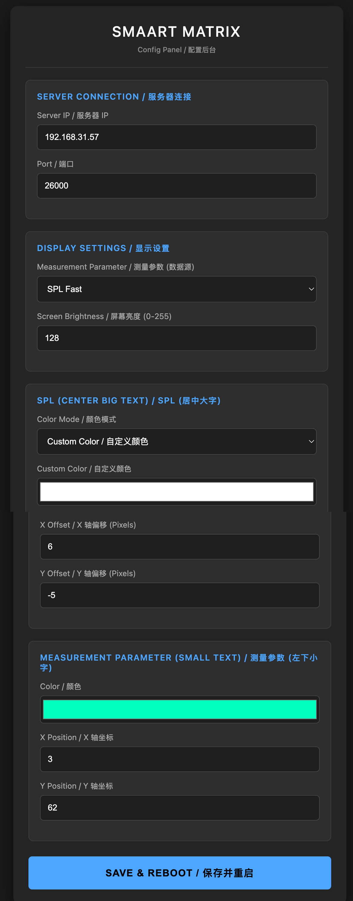
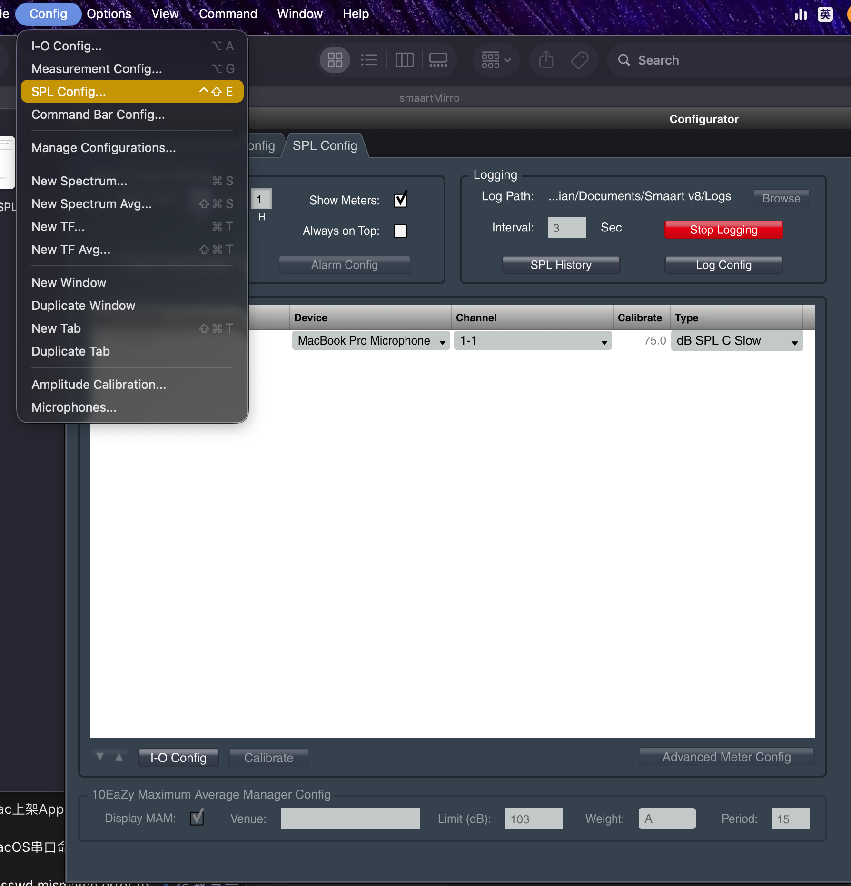

# SmaartLive HUB75 Display / Smaart 实时声压级矩阵屏

[English](#english) | [中文](#chinese)

---

## English

### Introduction
**SmaartLive Display** is an open-source project based on the ESP32 microcontroller and a HUB75 LED matrix. It connects directly to the **Smaart v9 (API v3)** server via WebSockets to fetch real-time SPL (Sound Pressure Level) metrics and visually display them on a 64x64 pixel LED matrix.

### Features
- **Real-time SPL Streaming**: Directly streams selected metrics (SPL Fast, Leq, etc.) via Smaart API v3.
- **Smart Captive Portal Setup**: Uses `WiFiManager` to handle initial network configuration. No hardcoded WiFi credentials.
- **Modern Web UI Configuration**: Built-in dark-themed, responsive web backend for tuning settings on the fly.
  - Switch between 14 different audio metrics (FS Peak, SPL A Slow, LAeq 10, etc.)
  - Set custom text colors or use Auto-Color based on SPL thresholds (Cyan <40, Green <70, Yellow <90, Orange <110, Red >110).
  - Precise X/Y offset controls for pixel-perfect typography.
  - Software-level screen brightness control.
- **Smooth Animation**: Utilizes DMA double-buffering to ensure zero screen flickering.
- **Retro Pixel Aesthetics**: Employs Adafruit's `Picopixel` font scaled for maximum visual impact.

### Web Backend Preview

### Hardware Requirements
- ESP32 Development Board (e.g., NodeMCU-32S, ESP32 Wroom)
- 64x64 HUB75 LED Matrix Panel
- HUB75 to ESP32 wiring (or a dedicated shield)

### Software Requirements & Libraries
Compiled using Arduino IDE. Please install the following libraries:
- `WiFi` (built-in ESP32)
- `WebServer` (built-in ESP32)
- `Preferences` (built-in ESP32)
- [WiFiManager](https://github.com/tzapu/WiFiManager) by tzapu
- [ESP32-HUB75-MatrixPanel-I2S-DMA](https://github.com/mrcodetastic/ESP32-HUB75-MatrixPanel-I2S-DMA) by mrcodetastic
- [WebSockets](https://github.com/Links2004/arduinoWebSockets) by Markus Sattler
- [ArduinoJson](https://arduinojson.org/) by Benoit Blanchon
- `Adafruit GFX Library` (for fonts)

### Usage & Configuration
1. **Flash the ESP32**: Flash the `smaartMirro.ino` code to your ESP32.
2. **Smaart Software Setup**:
   Ensure your Smaart software has the API enabled:
   Go to menu **Options -> API**, and enable the API server.
    
   
    
   Also, ensure that **SPL Logging** is turned on in your SPL meters.
    
   
3. **Connect to WiFi**: 
   On first boot, the ESP32 will create a WiFi hotspot named `HUB75-Smaart-AP`. Connect to it, go to `192.168.4.1`, and enter your local WiFi credentials.
4. **Configure Settings**:
   Once connected, the screen will display its assigned IP address. Open that IP address in your browser (e.g., `http://192.168.31.50`) to access the configuration panel and set your Smaart Server IP.

---

## Chinese

### 简介
**SmaartLive Display** 是一个基于 ESP32 与 HUB75 LED 矩阵屏的开源项目。它通过 WebSocket 协议直连 **Smaart v9 (API v3)** 服务器，实时拉取并在 64x64 点阵屏上炫酷地展示 SPL (声压级) 数据。

### 核心功能
- **实时声压级流传输**：通过 Smaart API v3 获取超低延迟的实时声压流。
- **智能配网**：内置 `WiFiManager`，初次开机手机连热点配置 WiFi，无需在代码里写死密码。
- **现代化高级后台**：提供深色主题 Web 配置界面，随时在手机或电脑上热更新屏幕配置：
  - 支持任意切换 14 种 Smaart 数据源（SPL Fast、LAeq 1 等）。
  - 支持全自定义颜色，或根据声压级自动阶梯变色 (青色<40, 绿色<70, 黄色<90, 橙色<110, 红色>110)。
  - 开放像素级 X/Y 轴文字位置微调。
  - 纯软件级无闪烁屏幕亮度控制。
- **丝滑无闪烁**：深度结合底层 DMA 双缓冲 (Double Buffering) 机制，画面刷新顺滑无闪屏。
- **赛博朋克像素风**：基于 `Picopixel` 极简点阵字体，放大渲染，视觉极具冲击力。

### 后台管理界面

### 硬件要求
- ESP32 开发板 
- 64x64 HUB75 LED 全彩点阵屏

### 依赖的第三方库
请在 Arduino IDE 中安装以下库：
- `WiFiManager`
- `ESP32-HUB75-MatrixPanel-I2S-DMA`
- `WebSockets`
- `ArduinoJson`
- `Adafruit GFX Library` 

### 使用说明
1. **烧录代码**：将 `smaartMirro.ino` 烧录至 ESP32。
2. **Smaart 软件端设置**：
   务必确保 Smaart 软件的 API 功能已开启：
   在顶部菜单中选择 **Options -> API** 并开启服务。
    
   
    
   并且**必须勾选开启 SPL Logging (声压日志)** 功能。
    
   
3. **初次配网**： 
   屏幕开机会建立名为 `HUB75-Smaart-AP` 的热点。连上后在浏览器打开 `192.168.4.1` 输入你家/场地的 WiFi 密码。
4. **后台配置参数**：
   连上 WiFi 后，屏幕会显示它的局域网 IP。在同一局域网下的手机或电脑浏览器中输入这个 IP（例如 `http://192.168.31.50`），即可进入暗黑版设置后台，填入你运行 Smaart 电脑的局域网 IP 即可开始使用！
